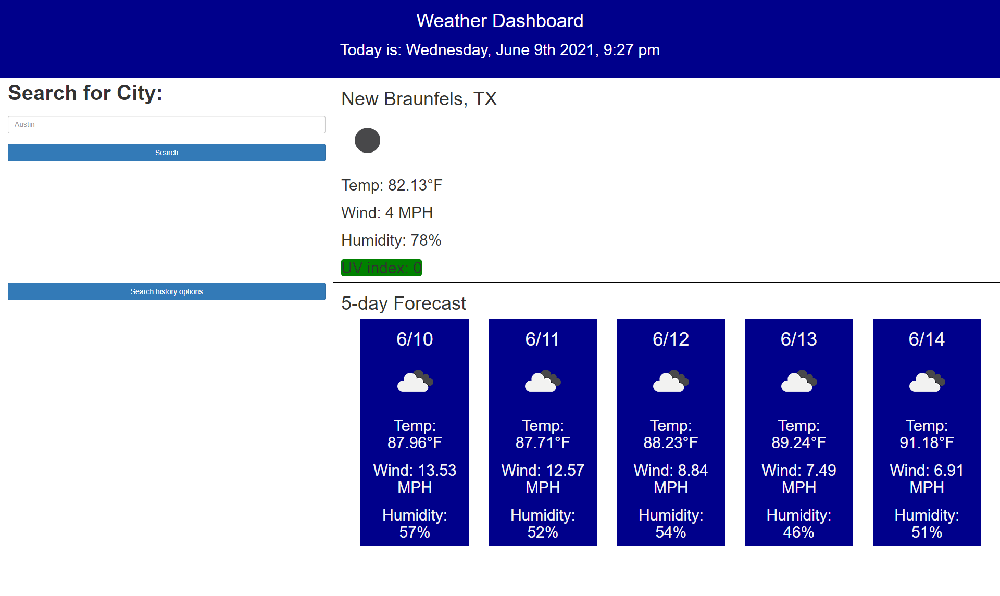

# 06 Server-Side APIs: Weather Dashboard

## Functionality

```
WHEN I load the Page, my location is calculated 
THEN I am presented with current and future conditions for my current location

GIVEN a weather dashboard with form inputs
WHEN I search for a city
THEN I am presented with current and future conditions for that city
WHEN I view current weather conditions for that city
THEN I am presented with the city name, the date, an icon representation of weather conditions, the temperature, the humidity, the wind speed, and the UV index
WHEN I view the UV index
THEN I am presented with a color that indicates whether the conditions are favorable, moderate, or severe
WHEN I view future weather conditions for that city
THEN I am presented with a 5-day forecast that displays the date, an icon representation of weather conditions, the temperature, the wind speed, and the humidity
```



Application Link: https://jmanauth.github.io/WeatherWidget/
Repo Link: https://github.com/JManauth/WeatherWidget